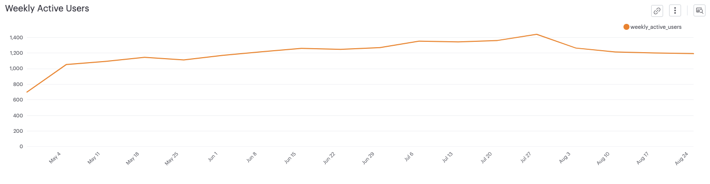
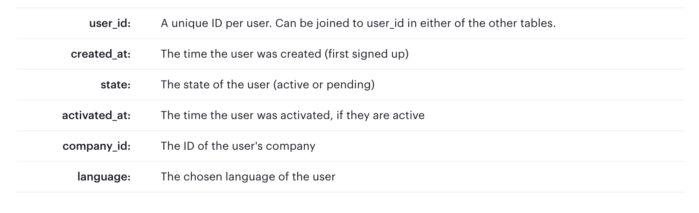
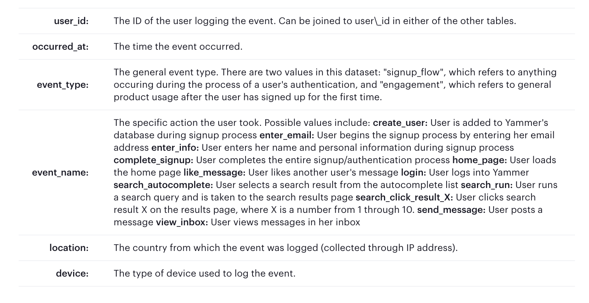
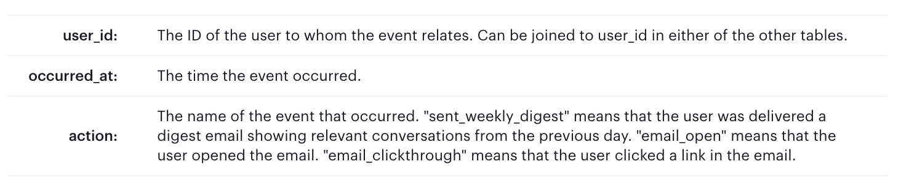
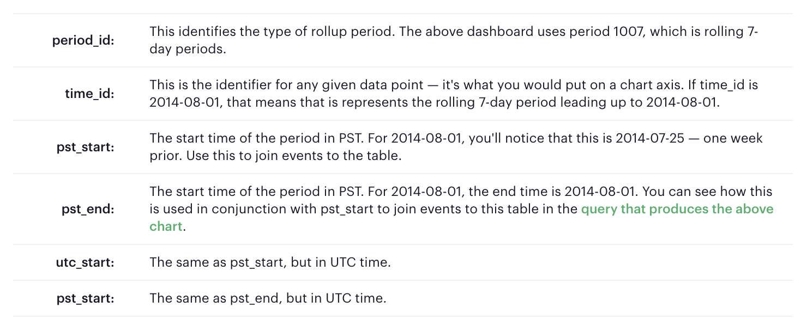

## Investigating a Drop in User Engagement
[On mode](https://mode.com/sql-tutorial/a-drop-in-user-engagement/#getting-oriented)

### Problem

A dip in user engagement.

### Potential Causes
* **Holiday**: 
It's likely that people using a work application like Yammer might engage at a lower rate on holidays. 
If one country has much lower engagement than others, it's possible that this is the cause.
* **Broken feature**: 
It is possible that something in the application is broken, and therefore impossible for people to use. 
This is a little harder to pinpoint because different parts of the application would show differently in the metrics. 
For example, if something in the signup flow broke, preventing new users from joining Yammer, growth would also be down. 
If a mobile app was unstable and crashed, engagement would be down for only that device type.
* **Broken tracking code**: 
It's possible that the code that logs events is, itself, broken. 
If you see a drop to absolutely zero events of a certain type and you rule out a broken feature, then this is a possibility.
* **Traffic anomalies from bots**: 
Most major website see a lot of activity from bots. 
A change in the product or infrastructure that might make it harder for bots to interact with the site could decrease engagement (assuming bots look like real users). 
This is tricky to determine because you have to identify bot-like behavior through patterns or specific events.
* **Traffic shutdown to your site**: 
It is possible for internet service providers to block your site.
This is pretty rare for professional applications, but nevertheless possible.
* **Marketing event**: 
A Super Bowl ad, for example, might cause a massive spike in sign-ups for the product. 
But users who enter through one-time marketing blitzes often retain at lower rates than users who are referred by friends, for example. Because the chart uses a rolling 7-day period, this will register as high engagement for one week, then almost certainly look like a big drop in engagement the following week. Most often, the best way to determine this is to simply ask someone in the Marketing department if anything big happened recently.
* **Bad data**: There are lots of ways to log bad data. 
For example, most large web apps separate their QA data from production data. 
One way or another, QA data can make its way into the production database.
This is not likely to be the problem in this particular case, as it would likely show up as additional data logged from very few users.
* **Search crawler changes**: 
For a website that receives a lot of traffic, changes in the way search engines index them could cause big swings in traffic.


### Data 
(Note: this data is fake and was generated for the purpose of this case study. 
It is similar in structure to Yammer's actual data, but for privacy and security reasons it is not real.)

#### Table 1: Users
This table includes one row per user, with descriptive information about that user's account.


#### Table 2: Events
This table includes one row per event, where an event is an action that a user has taken on Yammer. 
These events include login events, messaging events, search events, events logged as users progress through a signup funnel, events around received emails.


#### Table 3: Email Events
This table contains events specific to the sending of emails. 
It is similar in structure to the "events" table above.


#### Table 4: Rollup Periods
The final table is a lookup table that is used to create rolling time periods. 
Though you could use the INTERVAL() function, creating rolling time periods is often easiest with a table like this. 
You won't necessarily need to use this table in queries that you write, but the column descriptions are provided here so that you can understand the query that creates the chart shown above.


#### Digging in 
- Time period of analysis in `events` table:
```sql
SELECT
  MIN(occurred_at),
  MAX(occurred_at)
FROM
  tutorial.yammer_events
```
The time period of analysis expand from `2014-05-01 00:54:09` to `2014-08-31 23:03:39`.  

- Generating the *Weekly Active Users* chart:
```sql
SELECT
  drp.time_id,
  COUNT(DISTINCT e.user_id) AS weekly_active_users
FROM
  benn.dimension_rollup_periods drp
  LEFT JOIN tutorial.yammer_events e ON (
    e.occurred_at >= drp.pst_start
    AND e.occurred_at < drp.pst_end
    AND e.event_type = 'engagement'
  )
WHERE
  (
    drp.period_id = 1007
    AND drp.time_id >= '2014-05-01'
    AND drp.time_id < '2014-09-01'
  )
GROUP BY
  1
```

1. Check the growth (daily new sign-ups)
2. 