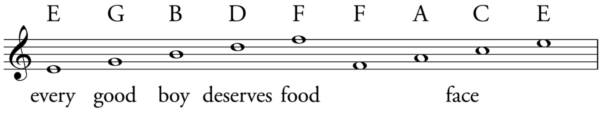
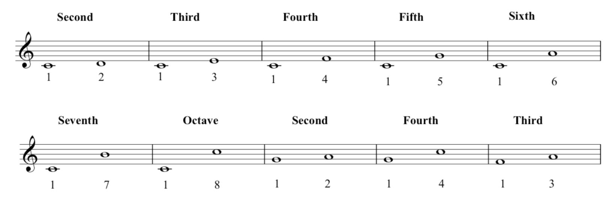
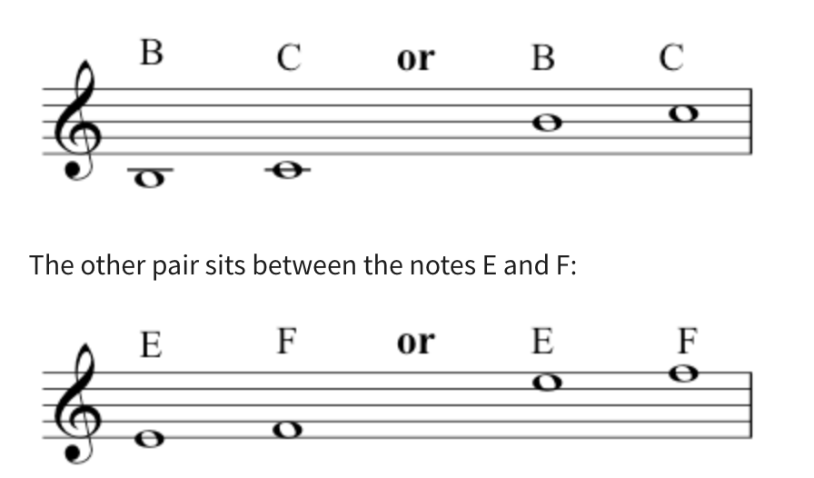
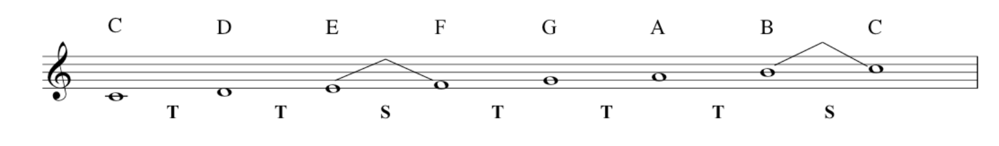

### Octave: 
The interval between (and including) two notes, one having twice or half the frequency of the vibration of the 
other.

### Treble Clef / G-Clef
### Pitch
### Octave (八度)
### Staff / stave (*brE*)

### middle C

### Semitone (半音)

### Tone (全音)
- C-D: a second interval (a tone)
- C-E: a third interval (two tones)
- B-C: a minor second interval (a semitone)

### Scale
#### Major Scale
##### C Major: 
(C = Tonic) Ionian mode

C - (T) - D - (T) - E- (S) - F - (T) -  G - (T) -  A - (T) -  B - (S) -  C

##### D Major: Dorian mode
D - E - F - G - A - B - C - D

##### E Major: Phrygian mode
E - F - G - A - B - C - D - E 

##### F Major: Lydian mode
F - G - A - B - C - D - E - F

##### G Major: Mixolydian mode
G - A - B - C - D - E - F - G

##### A Major: Aeolian Mode
A - B - C - D - E - F - G - A

##### B Major: Locrian Mode
B - C - D - E - F - G - A - B

#### Diatonic Scale
relating to, or being a musical scale (as a major or minor scale) comprising intervals of five whole steps and two half 
steps.

#### Natural Minor Scale (Aeolian Mode)
T - S - T - T - S - T - T