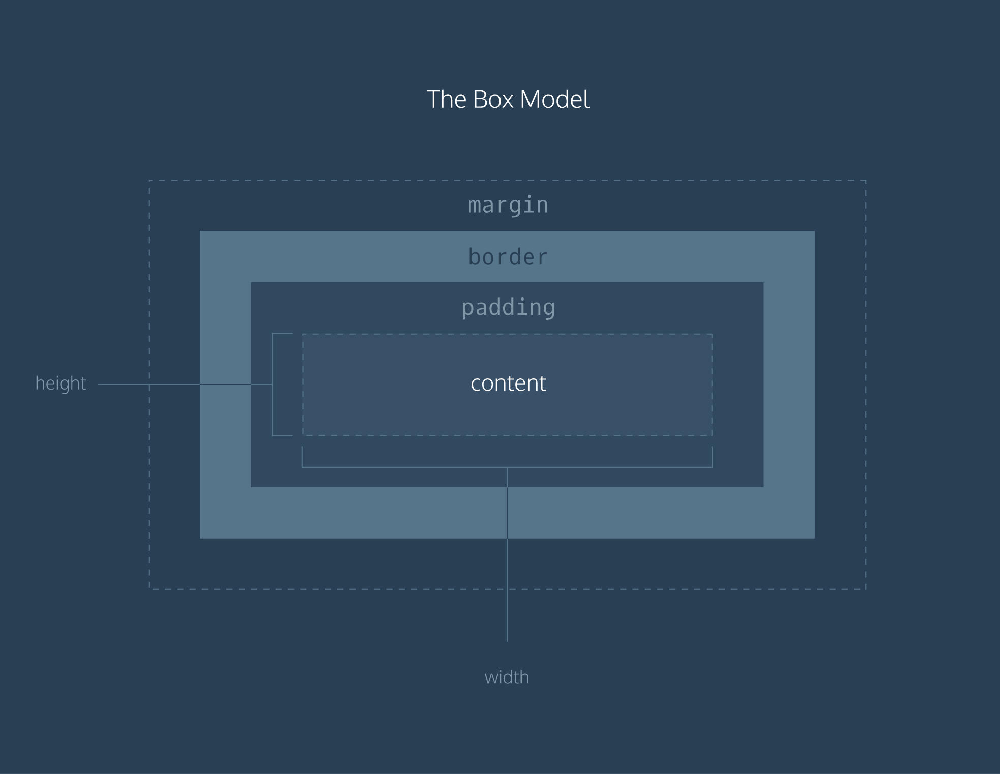
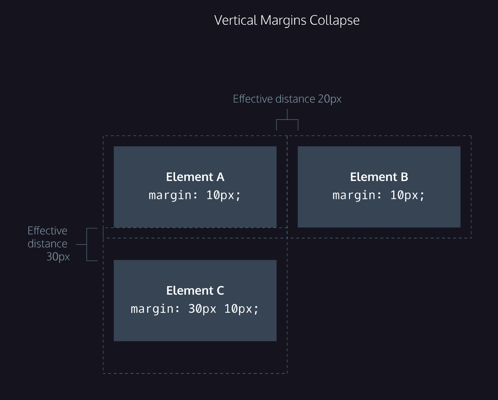
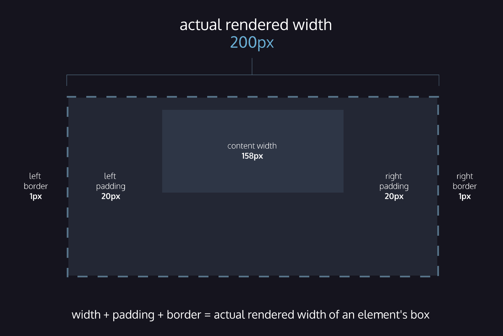
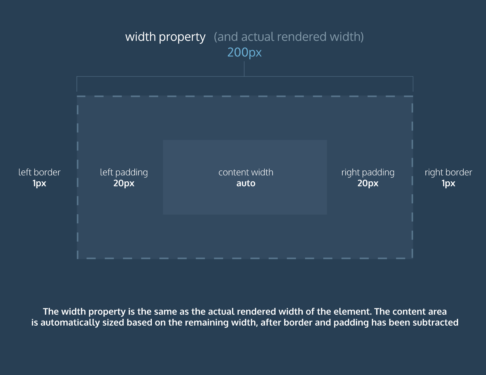

### Useful websites
[The Best Way to Learn HTML for Free (and Why You Should)](https://kinsta.com/blog/learn-html/#what-jobs-can-you-get-by-learning-html)  
[Codecademy courses](https://kinsta.com/blog/learn-html/#what-jobs-can-you-get-by-learning-html)  
[learn-html.org](https://www.learn-html.org/)  
[General Assembly Dash](https://dash.generalassemb.ly/)  
[MIT Open Course](https://ocw.mit.edu/courses/electrical-engineering-and-computer-science/)

### HTML (HyperText Markup Language)  
All HTML elements are boxes made up of four components: a content container, padding, border, and margin. 
1. Elements and Structure
  - [Cheatsheet](./cheatsheet/HTML_Elements%20and%20Structure.pdf)
  - [x] [Project: Fashion Blog](https://www.codecademy.com/courses/learn-html/projects/html-fashion-blog)
2. Tables
  - [Cheatsheet](./cheatsheet/HTML_Tables%20.pdf)
  - [x] [Project: Wine Festival Schedule](https://www.codecademy.com/courses/learn-html/projects/html-wine-festival-schedule)
3. Forms
  - [Cheatsheet](./cheatsheet/HTML%20Forms.pdf)
  - [Regular expressions](https://developer.mozilla.org/en-US/docs/Web/JavaScript/Guide/Regular_Expressions)
  - [x] [Project: Form a Story](https://www.codecademy.com/courses/learn-html/projects/form-a-story)
4. Semantic HTML
  - [Cheatsheet](./cheatsheet/HTML_%20Semantic.pdf)
  - [x] [Project: New York City Blog](https://www.codecademy.com/courses/learn-html/projects/semantic-html-nyc-blog)

### CSS (Cascading Style Sheets)
1. Syntax and Selectors
  - [Cheatsheet](./cheatsheets/CSS_%20Syntax%20and%20Selectors.pdf)
  - [ ] [Project: ]()
2. Visual Rules
  - [Cheatsheet](./cheatsheets/CSS_%20Visual%20Rules.pdf)
  - [x] [Project: Olivia Woodruff Portfolio](https://www.codecademy.com/courses/learn-css/projects/css-visual-rules-project)
3. The Box Model
  - [Cheatsheet](./cheatsheets/CSS_The%20Box%20Model.pdf)
  - The box model:   
    1. Width & Height
    2. Borders (default: `medium none color`)
       1. width
       2. style: [10 different styles](https://developer.mozilla.org/en-US/docs/Web/CSS/border-style#Values)
       3. color: [140 built-in color keywords](https://www.codecademy.com/courses/learn-css/lessons/box-model-intro/exercises/borders#:~:text=140%20built%2Din%20color%20keywords)
       4. Border radius
    3. Padding
       1. padding shorthand (`top` `right` `bottom` `left`)
    4. Margin
       1. Margin collapse:   
    5. Change box model (by changing the `box-sizing` property)
       1. Content box (default)
       
       2. Border box
       
    6. [View and edit an HTML element's box using Chrome DevTools.](https://www.codecademy.com/courses/learn-css/articles/f1-devtools-box-model)
  - Summary:
    1. The box model comprises a set of properties used to create space around and between HTML elements. 
    2. The height and width of a content area can be set in pixels or percentages. 
    3. Borders surround the content area and padding of an element. The color, style, and thickness of a border can be set with CSS properties. 
    4. Padding is the space between the content area and the border. It can be set in pixels or percent. 
    5. Margin is the amount of spacing outside of an element’s border. 
    6. Horizontal margins add, so the total space between the borders of adjacent elements is equal to the sum of the right margin of one element and the left margin of the adjacent element. 
    7. Vertical margins collapse, so the space between vertically adjacent elements is equal to the larger margin. 
    8. `margin: 0 auto` horizontally centers an element inside of its parent content area, if it has a width. 
    9. The `overflow` property can be set to `display`, `hide`, or `scroll`, and dictates how HTML will render content that overflows its parent’s content area. 
    10. The `visibility` property can hide or show elements.
4. Display and Positioning
  - [Cheatsheet]()
  - Flow of HTML:  
    A browser will render the elements of an HTML document that has no CSS from left to right, top to bottom, in the 
    same order as they exist in the document. This is called the flow of elements in HTML.   
    In addition to the properties that it provides to style HTML elements, CSS includes properties that change how a 
    browser positions elements. These properties specify where an element is located on a page, if the element can 
    share lines with other elements, and other related attributes.
    1. Position (`position` property)
    - `static` (default) elements stay in the normal flow of the document, scroll when page scrolls
    - `relative` (need offset properties `top` `bottom` `left` `right`) elements stay in the normal flow of the document, scroll when page scrolls
    - `absolute` elements are removed from the document flow stay at specified offset positions when a page scrolls
    - `fixed` elements are removed from the document flow stay at specified offset positions when a page scrolls
    - `sticky` keeps an element in the document flow as the user scrolls, but sticks to a specified position as the page is scrolled further.
    2. `z-index` (default=0)
5. Colors
  - [Cheatsheet]
6. Typography 
  - [Cheatsheet]